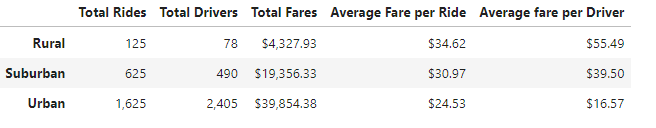
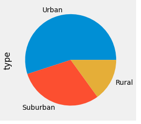
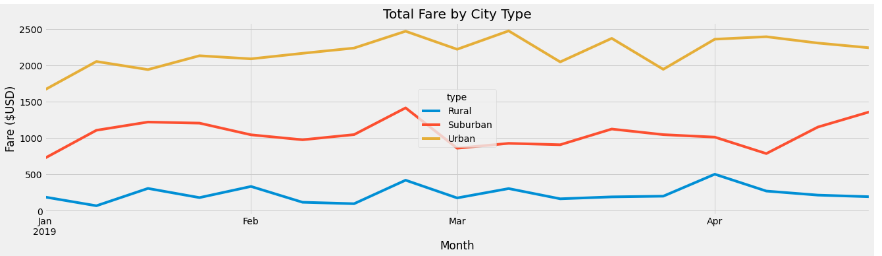

# PyBer_Analysis

## Resources

* Use Python and Pandas to create a summary data frame.
* Use Pandas and Matplotlib to create visualizations.
* Use Markdown to create a report explaining the results.

## Overview of the analysis

This analysis is being used to explore the data provided by Pyber so visualizations can be created to help understand and improve access to rideshare services. The same data is also used to determine the affordability in underserved areas.

## Results

The above image details the rideshare statistics in all three city types.

The above image gives you an idea of how the rides were distributed between the different city types.

The above image details the total fare by city type from January to April

## Summary

* Drivers in urban cities are earning less than drivers in rural cities which could discourage drivers given the low average fare per driver.

* The customers cost is higher in rural cities than urban cities which could discourage riders given the high average fare per ride.

* There is an opportunity to perform another analysis to determine the factors that are contributing to the higher ride costs in rural cities and lower driver fares in urban cities. Three factors that could be contributing to this is distance, total time spent driving, and operational costs per mile depending in which city type you decide to work.

* The economics of rideshares differs greatly depending in which city type you live. The analysis does show there is a higher usage of ridesharing services in urban cities compared to suburban and rural citites.